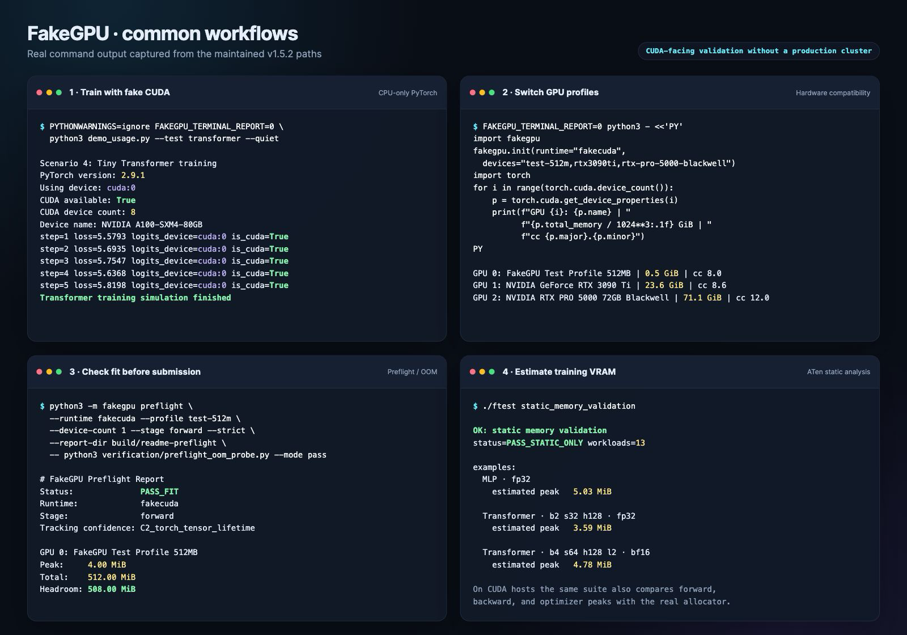

# FakeGPU

FakeGPU is a CUDA, cuBLAS, NVML, and NCCL interception toolkit for validating GPU-facing code without depending on a production GPU cluster. It provides a Python fake-CUDA path, native shared-library interception, configurable GPU profiles, distributed control-flow simulation, and memory preflight reports.

[Getting started](docs/getting-started.md) · [Quick reference](docs/quick-reference.md) · [中文文档](docs/index.zh.md) · [Changelog](CHANGELOG.md)

## TL;DR

**FakeGPU lets PyTorch/CUDA programs see simulated NVIDIA GPUs.** It runs common test flows on CPU, switches GPU profiles, checks likely out-of-memory failures, and estimates training memory before you use a real GPU.

It checks code paths and memory plans; it does not predict GPU kernel speed.
Its TCP benchmark measures the simulator path, not production NCCL/RDMA.

```bash
fakegpu doctor --list-profiles       # inspect the installation and GPU catalog
fakegpu demo --profile l4            # run a tiny CUDA-visible training step on CPU
fakegpu estimate-llm --model-dir /models/qwen --prompt-tokens 128  # inspect VRAM/FLOPs without loading weights
fakegpu bandwidth --listen 127.0.0.1:29591 --nodes 2  # simulate two TCP nodes
```



_Real command output from the maintained v1.5.4 workflows._

> FakeGPU is a development and validation tool. It does not provide numerical or performance parity for arbitrary CUDA kernels.

## Choose a path

| Goal | GPU required | Recommended entry point |
|---|---:|---|
| Check the installation and list GPU profiles | No | `fakegpu doctor --list-profiles` |
| Run the smallest end-to-end PyTorch example | No | `fakegpu demo --profile a100` |
| Exercise PyTorch CUDA-style code on CPU | No | `fakegpu.init(runtime="fakecuda")` |
| Intercept CUDA, NVML, cuBLAS, or NCCL shared-library calls | No | `./fgpu --mode simulate ...` |
| Check whether a workload reaches a stage or exceeds a GPU profile | No | `python3 -m fakegpu preflight ...` |
| Estimate training memory from an ATen graph | No | `./ftest static_memory_validation` |
| Estimate dense-decoder inference memory/FLOPs from safetensors metadata | No | `fakegpu estimate-llm ...` |
| Display memory from running FakeCUDA processes | No | `fakegpu nvidia-smi --state-dir ...` |
| Compare an unmodified real-GPU baseline | Yes | `./fgpu --mode passthrough ...` |
| Keep real CUDA compute while virtualizing selected surfaces | Yes | `./fgpu --mode hybrid --oom-policy clamp ...` |
| Simulate multi-rank collective control flow | No | `FAKEGPU_DIST_MODE=simulate` |
| Simulate logical machines over TCP and measure throughput | No | `fakegpu bandwidth --listen 127.0.0.1:29591 --nodes 2` |

## Quick start

### Check the installation and run the demo

From a checkout or installed package with PyTorch available:

```bash
python3 -m fakegpu doctor --list-profiles
python3 -m fakegpu demo --profile l4
```

`doctor` checks the profile catalog, native libraries, and PyTorch environment.
`demo` performs a small forward, backward, and optimizer step through the
CPU-backed fake-CUDA runtime. Neither command needs a physical GPU.

### Build the native libraries

Requirements: Linux or macOS, Python 3.10+, CMake 3.14+, and a C++17 compiler.

```bash
git clone https://github.com/FanBB2333/FakeGPU.git
cd FakeGPU

cmake -S . -B build
cmake --build build
./ftest smoke
```

The default build executes maintained cuBLAS/cuBLASLt operations on CPU. Generic CUDA kernel launches remain no-ops in native simulate mode.

### Run PyTorch code with fake CUDA semantics

From the repository root, with PyTorch installed:

```python
import fakegpu

fakegpu.init(runtime="fakecuda", profile="a100", device_count=2)

import torch

device = torch.device("cuda:0")
model = torch.nn.Linear(8, 4).to(device)
x = torch.randn(2, 8, device=device)
loss = model(x).square().mean()
loss.backward()

print(torch.cuda.device_count())
print(torch.cuda.get_device_name(0))
print(loss.item())
```

This route uses FakeCudaTensor semantics and CPU execution. It is suitable for training-flow, device-placement, error-handling, and framework compatibility checks. Custom CUDA extensions and arbitrary CUDA kernels are outside its maintained scope.

### Run a native intercepted command

`./fgpu` selects the built libraries and sets the preload environment:

```bash
./fgpu --profile a100 --device-count 2 nvidia-smi  # when nvidia-smi is installed
./fgpu --mode simulate python3 your_script.py
./fgpu --devices "a100:2,h100:2" python3 your_script.py
```

The same native route can be enabled before importing CUDA-using libraries:

```python
import fakegpu

fakegpu.init(runtime="native", profile="a100", device_count=2)

import torch
```

## AI workload preflight

Use preflight to check whether a command reaches a target stage and whether tracked memory fits a selected profile:

```bash
python3 -m fakegpu preflight \
  --runtime fakecuda \
  --profile a100 \
  --device-count 1 \
  --stage forward \
  --report-dir preflight-report \
  --allocation-stacks \
  --strict \
  -- python3 train.py --small-config
```

The command writes:

- `preflight_report.json`
- `preflight_report.md`
- `preflight_stdout.log`
- `preflight_stderr.log`

Preflight tracks tensor lifetimes, stage peaks, parameters, buffers, gradients, optimizer state, activations, shared-storage aliases, and saved tensors visible through PyTorch hooks. A matching empirical calibration report can replace the raw fake-CUDA estimate with an observed physical-memory upper bound.

See [AI Researcher Preflight](docs/ai-researcher-preflight.md) for calibration inputs, confidence levels, and current limits.

## Static memory estimation

The static estimator captures a target-device ATen forward/backward graph without allocating real CUDA memory. It models:

- unique tensor storages and aliases
- storage lifetime through final graph use
- parameters, buffers, gradients, and optimizer state
- separate graph and optimizer phases
- matched CUDA Attention workspace profiles
- operator-local workspace at the corresponding graph-liveness point

Run the maintained workload grid:

```bash
./ftest static_memory_validation
```

Or call the API directly:

```python
from fakegpu import estimate_module_memory

report = estimate_module_memory(
    model,
    (example_input,),
    mode="training",
    optimizer="adamw",
    target_device="auto",
)
print(report["estimated_peak_bytes"])
```

CUDA-specific ATen traces require a CUDA-enabled PyTorch build, but the trace itself does not allocate physical GPU memory.

Backend context memory, allocator fragmentation, unmatched workspaces, custom CUDA operators, and fused/foreach optimizer temporaries require device- and software-specific calibration.

## LLM inference without a GPU

For a local dense decoder checkpoint, FakeGPU can inspect safetensors headers
without materializing the weights or creating a CUDA context:

```bash
python3 -m fakegpu estimate-llm \
  --model-dir /models/Qwen/Qwen3-8B \
  --batch-size 1 \
  --prompt-tokens 9 \
  --generated-tokens 2 \
  --dtype bfloat16 \
  --attention-implementation sdpa \
  --json build/qwen-estimate.json
```

The report derives parameter storage from checkpoint metadata, KV-cache size
from layer/KV-head dimensions, transient tensor storage from the selected
attention path, and matrix FLOPs from model shapes. It currently targets dense
decoder-only safetensors checkpoints; MoE, quantized weights, adapters, custom
CUDA operators, and backend-specific workspaces need a dedicated model or
empirical calibration.

A FakeCUDA process can also publish its live tracked memory for a second
terminal:

```bash
FAKEGPU_SMI_STATE_DIR=/tmp/fakegpu-smi python3 your_inference.py
python3 -m fakegpu nvidia-smi --state-dir /tmp/fakegpu-smi
```

Set `FAKEGPU_SMI_RUNTIME_OVERHEAD_BYTES` only when the same GPU/software path
has been calibrated against NVML. See
[LLM Inference Estimation](docs/llm-inference-estimation.md) for a complete
real-CUDA/FakeCUDA comparison and the current accuracy boundary.

For training, `verification/qwen_sft_memory_worker.py` can run the same
full-parameter, LoRA, or packed-NF4 QLoRA reference step on real CUDA,
CPU-backed FakeCUDA, or a static ATen graph. The maintained 0.8B and 2B BF16
matrix covers gradient checkpointing and accumulation while distinguishing
first-step from steady-state AdamW memory. The QLoRA reference supports direct
FP32 block scales and optional bitsandbytes-style nested 8-bit scale storage:

```bash
python3 verification/qwen_sft_memory_worker.py \
  --mode static --model-dir /models/Qwen3.5-0.8B \
  --training-method qlora --quantization-double-quantization \
  --output build/qwen-sft-qlora-static.json
```

For full-parameter FSDP, a second controller projects the same static ATen
graph onto per-unit FULL_SHARD storage and checks it against a real two-rank
optimizer step:

```bash
python3 verification/qwen_sft_memory_worker.py \
  --mode static --model-dir /models/Qwen3.5-0.8B \
  --output build/qwen-sft-static.json

python3 verification/run_qwen_fsdp_sft_memory.py \
  --model-dir /models/Qwen3.5-0.8B \
  --static-report build/qwen-sft-static.json \
  --output-dir build/qwen-fsdp-sft-memory
```

The maintained Ampere and Blackwell sequence-16/128 experiments keep graph
and overall peak errors below 0.76% while recording all-gather and
reduce-scatter traffic.

LoRA uses the FSDP2 controller because its frozen BF16 base and trainable FP32
adapters cannot be represented by one FSDP1 flat-parameter dtype:

```bash
python3 verification/qwen_sft_memory_worker.py \
  --mode static --model-dir /models/Qwen3.5-0.8B \
  --training-method lora --lora-rank 8 --sequence-length 16 \
  --output build/qwen-fsdp2-lora-static.json

python3 verification/run_qwen_fsdp2_lora_sft_memory.py \
  --model-dir /models/Qwen3.5-0.8B \
  --static-report build/qwen-fsdp2-lora-static.json \
  --sequence-length 16 --world-size 4 \
  --output-dir build/qwen-fsdp2-lora
```

This path models each DTensor shard and all-gather/reduce-scatter buffer
lifetime separately. Qwen3.5-0.8B sequence-16/64/128 runs with two or four
ranks on both the RTX PRO 5000 and RTX 3090 Ti keep every phase within 1.98%
while exercising mixed-dtype `uint8` all-gathers. Existing dimensions such as
sequence length, LoRA rank, dtype, and world size 2/4 are command parameters;
new tests along those dimensions do not require source changes.

The native NF4 path needs no external quantization package, but it does not
claim bitsandbytes fused-kernel equivalence; see
[LLM SFT Memory Estimation](docs/llm-sft-memory-estimation.md).

## Runtime model

FakeGPU separates the Python runtime path, native compute mode, and distributed mode.

### Python runtime

| Runtime | Behavior |
|---|---|
| `fakecuda` | Patches PyTorch with FakeCudaTensor behavior and executes maintained operations on CPU |
| `native` | Loads FakeGPU shared libraries into the current process |
| `auto` | Selects `fakecuda` when available, otherwise uses `native` |

### Native compute mode

| `FAKEGPU_MODE` | Behavior | Real GPU |
|---|---|---:|
| `simulate` | Virtual device identity and memory; maintained cuBLAS/cuBLASLt paths can execute on CPU | No |
| `passthrough` | Unmodified real-CUDA baseline with no FakeGPU CUDA/NVML injection | Yes |
| `hybrid` | Real CUDA compute with selected Driver/NVML virtualization and OOM policy handling | Yes |

Hybrid OOM policies:

```text
clamp | managed | mapped_host | spill_cpu
```

`clamp` is the maintained validation path. Oversubscription policies are experimental and do not guarantee numerical parity.

### Distributed mode

| `FAKEGPU_DIST_MODE` | Behavior |
|---|---|
| `disabled` | No FakeGPU distributed layer |
| `simulate` | Coordinator-managed collective and point-to-point semantics |
| `proxy` | Real NCCL data movement with FakeGPU control-plane reporting |
| `passthrough` | Thin forwarding to real NCCL |

Compute and distributed modes can be combined. The recommended CPU-only mode pair is:

```bash
FAKEGPU_MODE=simulate
FAKEGPU_DIST_MODE=simulate
```

The simulated distributed path also needs a coordinator endpoint and cluster configuration. For complete coordinator and `torchrun` examples, see [Distributed Simulation Usage](docs/distributed-sim-usage.md).

For a self-contained two-node loopback check on a chosen port:

```bash
fakegpu bandwidth \
  --listen 127.0.0.1:29591 \
  --nodes 2 \
  --ranks-per-node 1 \
  --size 4MiB \
  --iterations 10
```

This starts the coordinator, generates a two-node topology, moves collective
payloads through TCP, checks the all-reduce result, reports measured
end-to-end throughput, and shuts the coordinator down. A separately hosted
coordinator and per-host rank selection are available for physical multi-host
checks.

## Capability map

| Surface | Maintained behavior | Important boundary |
|---|---|---|
| CUDA Driver/Runtime | Device discovery, memory allocation/copy, streams/events, selected Driver forwarding | The full CUDA API is not implemented |
| NVML | Device identity, memory information, common monitoring queries | Some telemetry fields are synthetic or unavailable |
| cuBLAS/cuBLASLt | Selected GEMM/matmul operations with CPU-backed execution | Unsupported algorithms may remain stubbed |
| PyTorch fake-CUDA | Common tensor, module, autograd, optimizer, Transformers, PEFT, Accelerate, and FSDP smoke paths; real-CUDA Hybrid DDP/FSDP numerical checks | Custom CUDA extensions are not emulated |
| NCCL-style communication | Collective and point-to-point control flow, TCP socket payloads, topology-aware reporting, PyTorch-required NCCL 2.29 host symbols | Not a protocol-level NCCL/RDMA/NVLink model; device-communicator and signal/RMA operations are not simulated |
| Memory preflight | Runtime tracking, ATen static analysis, empirical GPU calibration | Results apply to the validated shape and software envelope |
| Error simulation | OOM, invalid device, cross-device, dtype/autocast, gradient, and checkpoint cases | Error timing can differ from a real driver |

## GPU profiles

Profiles are stored under `profiles/<architecture>/<segment>/*.yaml`, loaded by
the Python runtime, and compiled into native builds. Catalog segments are
`consumer`, `datacenter`, `workstation`, `embedded`, and `test`:

```text
profiles/
├── ampere/
│   ├── consumer/rtx3090ti.yaml
│   ├── datacenter/a100.yaml
│   ├── embedded/jetson-agx-orin-64gb.yaml
│   └── test/test-512m.yaml
└── blackwell/
    ├── datacenter/b200.yaml
    ├── embedded/jetson-t5000.yaml
    └── workstation/rtx-pro-5000-blackwell.yaml
```

The catalog currently contains 24 profiles across 8 NVIDIA architectures and
15 compute capabilities:

| Architecture | Segment(s) | Compute capability | Profile IDs |
|---|---|---|---|
| Maxwell | Consumer | 5.2 | `gtx980` |
| Pascal | Data center | 6.0, 6.1 | `p100`, `p4` |
| Volta | Data center | 7.0 | `v100` |
| Turing | Data center | 7.5 | `t4` |
| Ampere | Consumer, data center, embedded, test | 8.0, 8.6, 8.7 | `a100`, `a100-1g`, `a30`, `a10`, `a40`, `rtx3090ti`, `jetson-agx-orin-64gb`, `test-512m` |
| Ada | Data center | 8.9 | `l4`, `l40s` |
| Hopper | Data center | 9.0 | `h100`, `h200` |
| Blackwell | Data center, embedded, workstation | 10.0, 10.3, 11.0, 12.0, 12.1 | `b100`, `b200`, `b300`, `jetson-t5000`, `rtx-pro-5000-blackwell`, `rtx-pro-6000-blackwell`, `gb10` |

Every profile declares `compute_major` and `compute_minor`; both the Python
catalog validator and native C++ loader reject an architecture/compute
capability mismatch. Model-to-capability mappings come from NVIDIA's
[current CUDA GPU table](https://developer.nvidia.com/cuda/gpus) and
[legacy table](https://developer.nvidia.com/cuda/gpus/legacy). Product
specification URLs and whether a profile is measured, reference, or synthetic
are recorded in each YAML file.

Refresh or verify the checked-in NVIDIA model snapshot with:

```bash
python3 scripts/update_nvidia_gpu_catalog.py
python3 scripts/update_nvidia_gpu_catalog.py --check
```

Jetson and GB10 profiles describe unified system memory, not a GPU-exclusive
allocation budget. See [profiles/README.md](profiles/README.md) for data
provenance, status meanings, and validation rules.

Select one uniform profile or a heterogeneous device list:

```bash
./fgpu --profile rtx3090ti --device-count 2 python3 your_script.py
./fgpu --devices "t4,a100:2,h100" python3 your_script.py
```

Equivalent environment variables:

```bash
FAKEGPU_PROFILE=a100
FAKEGPU_DEVICE_COUNT=8
FAKEGPU_PROFILES=a100:4,h100:4
```

## Reports

| Report | Produced by | Contents |
|---|---|---|
| `fake_gpu_report.json` | Native runtime | Per-device peak memory, IO, calls, and maintained GEMM FLOPs |
| `cluster_report.json/.md` | Distributed coordinator | Collective/P2P totals, communicator-aware node-pair traffic, directional/per-operation peaks, bounded coordinator-observed timeline, modeled throughput, and rank statistics |
| TCP bandwidth report | `fakegpu bandwidth --json ...` | Validated payload size, per-rank timings, and end-to-end socket throughput |
| `preflight_report.json/.md` | Preflight CLI | Stage status, fit/OOM result, memory categories, and confidence |
| Real-GPU calibration report | `./ftest real_gpu_calibration` | Real, passthrough, hybrid, fakecuda, allocator, and NVML observations |
| Static memory validation report | `./ftest static_memory_validation` | Graph liveness, optimizer phases, workspace profiles, and real-CUDA comparison |
| LLM inference estimate | `fakegpu estimate-llm --json ...` | Checkpoint storage, KV cache, transient tensors, process-memory estimate, and matrix FLOPs |
| Virtual SMI state | `FAKEGPU_SMI_STATE_PATH` / `FAKEGPU_SMI_STATE_DIR` | Per-process current/peak tracked bytes and optional calibrated runtime overhead |

Output paths can be configured with:

```bash
FAKEGPU_REPORT_PATH=/path/to/fake_gpu_report.json
FAKEGPU_CLUSTER_REPORT_PATH=/path/to/cluster_report.json
FAKEGPU_CLUSTER_REPORT_MARKDOWN_PATH=/path/to/project_communication.md
```

When only `FAKEGPU_CLUSTER_REPORT_PATH` is set, FakeGPU automatically writes
the Markdown report beside the JSON file. Every distinct node pair from the
cluster configuration appears in its table, including pairs with zero traffic.
The JSON contract is `cluster_report.v1`, defined by
`cluster_report.schema.json`; `verification/check_cluster_report.py` validates
it by default. Sub-communicators retain their global-rank membership, and
successful P2P sends are counted once rather than once at each endpoint.

## Validation snapshot

The maintained cross-GPU static-memory grid was checked on:

| GPU | Compute capability | PyTorch / CUDA |
|---|---:|---|
| NVIDIA GeForce RTX 3090 Ti | 8.6 | PyTorch 2.12.1 / CUDA 13.0 |
| NVIDIA RTX PRO 5000 72GB Blackwell | 12.0 | PyTorch 2.9.1 / CUDA 12.8 |

Across 13 MLP/Transformer workloads and 26 GPU observations:

- static peak bytes matched across both hosts
- maximum allocated-byte absolute error was `0.077160%`
- maximum requested-byte absolute error was `0.001358%`
- FP32 Efficient Attention requested-byte differences were at most 28 bytes
- no maintained Attention workload used an unprofiled or extrapolated profile

These results validate the maintained parameter grid. They do not establish accuracy for arbitrary models, shapes, PyTorch releases, or CUDA backends.

The Qwen3-8B BF16 inference path was also checked on the RTX PRO 5000 with
SDPA, a 9-token prompt, and two generated token IDs:

| Comparison | Predicted | Real CUDA | Absolute error |
|---|---:|---:|---:|
| Model load: FakeCUDA tracked vs allocator | 16,381,470,976 B | 16,383,586,816 B | 0.012914% |
| Inference peak: FakeCUDA tracked vs allocator | 16,385,992,936 B | 16,396,630,528 B | 0.064877% |
| Inference peak: checkpoint-only estimate vs allocator | 16,385,606,472 B | 16,396,630,528 B | 0.067234% |
| Process memory: virtual SMI vs NVML | 16,825,298,920 B | 16,835,936,256 B | 0.063182% |
| Matrix FLOPs: FakeCUDA execution vs CUDA | 151,415,620,864 | 151,415,620,864 | 0% |
| Matrix FLOPs: shape estimate vs CUDA | 151,415,619,584 | 151,415,620,864 | 0.000001% |

The virtual-SMI row includes a `442,049,024`-byte runtime overhead measured in
that same CUDA run. That value is evidence for this GPU, PyTorch, CUDA, model,
and operator path—not a portable constant.

The distributed paths were also checked on the same two hosts:

| Check | Placement | Result |
|---|---|---|
| Hybrid DDP numerical check | Two ranks sharing the RTX PRO 5000, then two ranks sharing the RTX 3090 Ti | Averaged gradient `[1.5, 3.0]`, identical gathered parameters, and the expected SGD update on both CUDA 12.8 and CUDA 13.0 |
| Hybrid FSDP numerical check | Two ranks sharing each GPU | Full sharding, averaged reduce-scatter gradients, optimizer update, full-parameter reconstruction, and state-dict restoration passed on both CUDA stacks |
| Hybrid FSDP2/DTensor matrix | Two or four ranks sharing each GPU | FP32, FP16, and BF16 parameter paths passed; FP16/BF16 gradient reduction also passed with reconstructed DTensor parameters |
| Hybrid DeepSpeed ZeRO matrix | Two or four ranks sharing each GPU | ZeRO 0–3, FP32/BF16, gradient accumulation, optimizer updates, and cross-rank parameter consistency passed on DeepSpeed 0.15.3 and 0.19.2 |
| Qwen3.5 DeepSpeed LoRA SFT | Two ranks sharing each GPU | ZeRO-2/3 forward, backward, AdamW update, communication report, accumulation, and reentrant checkpointing passed with local Qwen3.5-0.8B weights |
| DeepSpeed checkpoint and offload | Two ranks sharing each GPU | ZeRO-2/3 save/restore/continued training/FP32 consolidation passed; ZeRO-2 optimizer and ZeRO-3 optimizer + parameter CPU offload placed the requested state on CPU |
| Hugging Face Trainer + DeepSpeed | Two ranks sharing each GPU | Tiny ZeRO-2/3 and Qwen3.5-0.8B LoRA ZeRO-3 completed real updates, gradient accumulation, checkpointing, and rank-consistency checks |
| Physical-host Hybrid DDP | One rank on the RTX PRO 5000 ↔ one rank on the RTX 3090 Ti | The same numerical result across PyTorch 2.9.1/CUDA 12.8 and PyTorch 2.12.1/CUDA 13.0; TCP broadcast, all-reduce, and all-gather completed with zero timeouts |
| Physical-host Hybrid FSDP2 | One rank on the RTX PRO 5000 ↔ one rank on the RTX 3090 Ti | FP32/FP16/BF16 parameters and FP16/BF16 gradient reductions passed over TCP; the report identifies collective dtype and reduction operator |
| Physical-host Hybrid DeepSpeed | One rank per physical GPU over Tailscale | ZeRO-2 passed across DeepSpeed 0.15.3 ↔ 0.19.2 with identical parameters and 176 reported node-pair bytes; ZeRO-3 now rejects mismatched DeepSpeed versions during preflight |
| Physical-host TCP all-reduce | RTX PRO 5000 coordinator/rank 0 ↔ RTX 3090 Ti rank 1 over Tailscale | Correct 1 MiB and 16 MiB reductions, zero coordinator timeouts; 16 MiB × 5 measured about `0.261 Gbit/s` algorithmic and `0.521 Gbit/s` bidirectional socket payload per rank |

The TCP numbers are an end-to-end simulator measurement from this specific
test network. They are not raw link capacity or an NCCL/RDMA performance
prediction.

## Test suites

```bash
./ftest smoke
./ftest cpu_sim
./ftest python
./ftest preflight_oom
./ftest tcp_bandwidth
./ftest distributed_resilience
./ftest static_memory_validation
./ftest real_gpu_calibration
python3 -m pytest -q
```

| Suite | Purpose |
|---|---|
| `smoke` | Build, library boundaries, preload, profiles, and memory types |
| `cpu_sim` | CPU-backed cuBLAS/cuBLASLt correctness |
| `python` | Basic PyTorch native-interception path |
| `preflight_oom` | Fit/OOM classification and report validation |
| `tcp_bandwidth` | Two logical nodes, TCP payload correctness, and throughput reporting |
| `distributed_resilience` | Collective mismatch, missing-peer timeout, and bounded operation-timeline retention |
| `static_memory_validation` | ATen graph memory estimation; optional real-CUDA comparison |
| `real_gpu_calibration` | Real/passthrough/hybrid/fakecuda comparison on a supported GPU |

Additional distributed and framework checks are listed in [Reports and Validation](docs/reports-and-validation.md).
On a real CUDA host, the maintained numerical commands are:

```bash
python3 verification/run_hybrid_ddp_numerics.py --variant all
python3 verification/run_hybrid_fsdp_numerics.py
python3 verification/run_hybrid_fsdp2_numerics.py --world-size 4 --precision bf16
python3 verification/run_hybrid_fsdp2_numerics.py --world-size 4 --precision bf16 --reduce-precision parameter
python3 verification/run_hybrid_deepspeed_numerics.py --zero-stage all --precision bf16
python3 verification/run_hybrid_deepspeed_numerics.py --zero-stage 3 --precision fp32 --offload optimizer-and-parameter
python3 verification/run_hybrid_deepspeed_checkpoint.py --zero-stage 3 --precision fp32
python3 verification/run_hf_trainer_deepspeed.py --workload tiny --zero-stage 3 --precision bf16
python3 verification/run_qwen_deepspeed_lora_sft.py --model-dir /path/to/Qwen3.5-0.8B --output-dir build/qwen-deepspeed --zero-stage 3
```

The DeepSpeed checks cover the native Engine and a Transformers/PEFT Qwen
model with PyTorch optimizers, ZeRO checkpoint resume, Hugging Face Trainer,
and CPU optimizer/parameter offload. Fused/JIT optimizers, NVMe offload,
pipeline/tensor/MoE parallelism, and physical ZeRO-3 with matching DeepSpeed
versions remain separate validation targets. See
[DeepSpeed Validation](docs/deepspeed-validation.md) for commands, measured
results, and the WSL-without-`nvcc` setup.

The physical two-host controller in
`verification/run_physical_multihost.py` verifies that both repositories use
the same Git commit, launches Hybrid DDP (including common execution options),
FSDP/FSDP2 (including mixed-precision parameters and reductions), optional
DeepSpeed ZeRO-2/3 cases, and TCP fault cases, then collects JSON and Markdown
reports on the control host.
Cluster report validation also reconciles collective/P2P
counters, operation-timeline retention, collective dtype/reduction metadata,
directional links, and node-pair totals.

## Architecture

```text
GPU-facing application
├── Python runtime: fakegpu.init(runtime="fakecuda")
│   └── FakeCudaTensor + FakeGPU policies
│       └── maintained PyTorch operations execute on CPU
│
└── Native runtime: ./fgpu or fakegpu.init(runtime="native")
    └── libcuda / libcudart / libcublas / libnvidia-ml / libnccl
        ├── GlobalState: profiles, allocations, streams, metrics
        ├── system RAM and CPU-backed maintained math paths
        ├── optional real CUDA forwarding in hybrid mode
        └── coordinator for simulated distributed operations

Reports: device JSON · cluster JSON · preflight · calibration · static memory
```

## Limitations

- Native simulate mode does not execute arbitrary CUDA kernels.
- FakeCudaTensor covers Python/PyTorch behavior, not binary CUDA extensions.
- The checkpoint-only LLM estimator supports dense decoder-only safetensors models; it does not infer arbitrary repository control flow, MoE routing, quantization state, or custom kernels.
- Supported cuBLAS/cuBLASLt operations can be numerically checked on CPU; unsupported operations may be stubs.
- Distributed simulation checks semantics and control flow. Its TCP result includes coordinator reduction, memory copies, and process scheduling, so it is not an exact NCCL/RDMA or raw-link measurement.
- Static and runtime memory estimates can omit backend-internal allocations outside matched profiles.
- Hybrid mode requires a real GPU and remains limited to validated Driver/runtime surfaces.
- macOS system binaries can remove `DYLD_*` variables because of SIP; use a Homebrew, conda, or pyenv Python.

## Documentation

- [Getting Started](docs/getting-started.md)
- [Quick Reference](docs/quick-reference.md)
- [AI Researcher Preflight](docs/ai-researcher-preflight.md)
- [LLM Inference Estimation](docs/llm-inference-estimation.md)
- [LLM SFT Memory Estimation](docs/llm-sft-memory-estimation.md)
- [Architecture and Project Structure](docs/project-structure.md)
- [Torch Patch System](docs/phase2-custom-torch.md)
- [Reports and Validation](docs/reports-and-validation.md)
- [Distributed Simulation Usage](docs/distributed-sim-usage.md)
- [Distributed Design Notes](docs/multi-node-design.md)
- [cuBLASLt Compatibility Notes](docs/cublaslt-fix.md)
- [Error Simulation](docs/error-simulation.md)

Preview the documentation site:

```bash
python3 -m pip install -e ".[docs]"
mkdocs serve
```

## License

[MIT](LICENSE)
